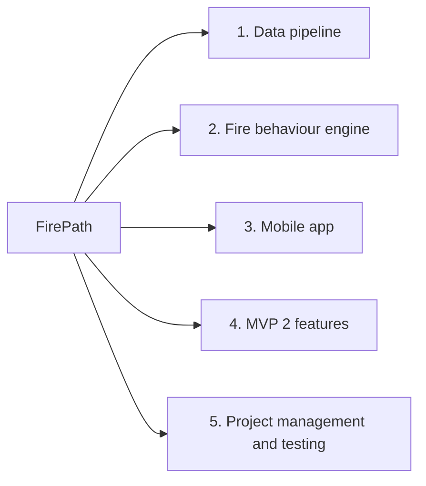

# Project Scope Statement

**Project Name:** FirePath

This is an early version of our scope. We're still in the preliminary stages, so we'll update it as we learn more.

---

## Project Deliverables

| Deliverable | Description |
|---|---|
| 1. Data pipeline | Downloads government data on a schedule, cleans it and stores it |
| 2. Fire behaviour engine | Runs the official Canadian fire behaviour code, draws the spread shapes and gives the danger level in plain language. Checked against the official cffdrs package and FBP Go |
| 3. Web app | The map people tap, plus the backend, accounts, saved places and alerts |
| 4. MVP 2 features | What-if mode, trip planning and fire history |
| 5. Project management and testing | Course documents, prototypes, user research and the Bazaar demo |

---

## Project Exclusions

- Official alerts or evacuation orders. SaskAlert and SPSA handle those.
- Tools for fire crews. We are not replacing professional fire software like FBP Go or REDapp.
- Predicting where fires will start, or making our own weather forecasts.
- Coverage outside Saskatchewan in the first version.
- Native App Store or Google Play apps, offline mode, French language support and paid features in the first version.
