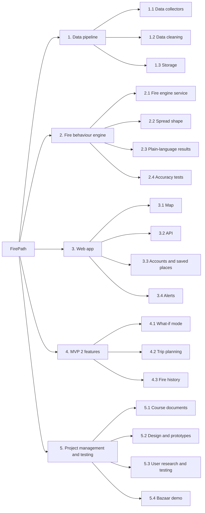

# Project Scope Statement

**Project Name:** FirePath

---

## Project Deliverables

### 1. Data pipeline
| Work package | Description |
|---|---|
| 1.1 Data collectors | Scripts that download each government data source on a schedule and keep a raw copy |
| 1.2 Data cleaning | Checks and fixes the data (units, bad values, false fire detections) and lines up all the maps |
| 1.3 Storage | Map data files plus a database for fires, fire history, users and saved places |

### 2. Fire behaviour engine
| Work package | Description |
|---|---|
| 2.1 Fire engine service | Runs the official Canadian fire behaviour code for a given spot |
| 2.2 Spread shape | Turns the results into spread shapes for 1, 2 and 4 hours |
| 2.3 Plain-language results | Official danger level, a short explanation and the safety note |
| 2.4 Accuracy tests | Compares our results with the official cffdrs package and FBP Go |

### 3. Web app
| Work package | Description |
|---|---|
| 3.1 Map | The map people tap, with the spread shape and map layers |
| 3.2 API | The backend routes the map talks to |
| 3.3 Accounts and saved places | Sign up, log in and saving places |
| 3.4 Alerts | Checks saved places after each data update and notifies users of changes |

### 4. MVP 2 features
| Work package | Description |
|---|---|
| 4.1 What-if mode | Sliders for wind and dryness, labelled as a scenario and not a forecast |
| 4.2 Trip planning | Fire danger for each stop on a trip |
| 4.3 Fire history | Past wildfires around a spot |

### 5. Project management and testing
| Work package | Description |
|---|---|
| 5.1 Course documents | The design workshop and project management documents |
| 5.2 Design and prototypes | User story map, lo-fi and hi-fi prototypes |
| 5.3 User research and testing | Interviews and usability testing |
| 5.4 Bazaar demo | Demo that replays a real past fire day |

---

## Project Exclusions

- Official alerts or evacuation orders. SaskAlert and SPSA handle those.
- Tools for fire crews. We are not replacing professional fire software like FBP Go or REDapp.
- Predicting where fires will start, or making our own weather forecasts.
- Fire growth that changes across different terrain, and wind adjusted for hills and valleys (possible later goal).
- Coverage outside Saskatchewan in the first version.
- Native App Store or Google Play apps in the first version.
- Offline mode and French language support in the first version.
- Payments or paid features.
